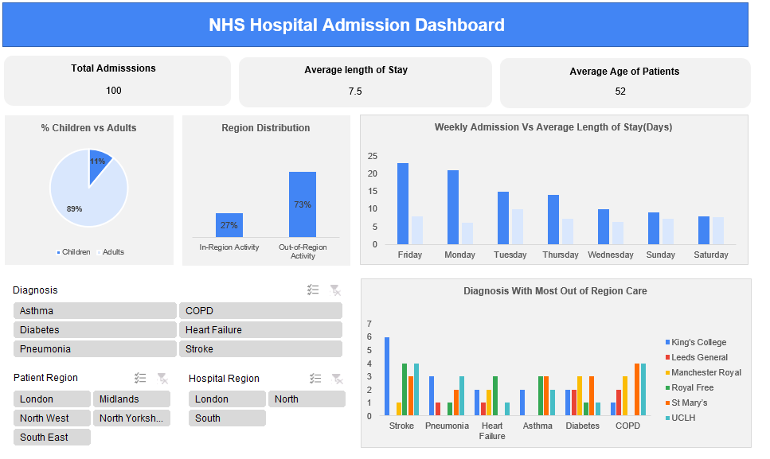

# 🏥 NHS Hospital Admission Analysis 

This project presents a visual analysis of hospital admission trends within the NHS, providing key insights on patient demographics, regional activity, diagnosis trends, and hospital performance. The dashboard was built to support data-driven decision-making for healthcare providers and administrators.

# 🎯 Purpose
The primary goal of this project is to support healthcare professionals and decision-makers by addressing the following key questions:

Dashboard Summary

- Which diagnosis is mostly likely to require out of region care?

  The dataset indicates that stroke is the most frequent diagnosis linked to out-of-region care, ranking in the top two    diagnoses for four out of the six hospitals included in the analysis. This trend likely reflects the urgent nature of stroke cases, where patients are transported to the nearest available facility regardless of regional boundaries to ensure immediate treatment. While the pattern is clear, it's important to note that the dataset is limited in size.

- What is the busiest admission day of the week across all hospitals? How does its average length of stay compare to the quietest day?

  Friday saw the highest admissions (23), topping 5 of 6 hospitals, while Saturday was the quietest (8). This pattern aligns    with healthcare trends: patients often avoid weekend stays, and specialist services may be reduced. Yet, Friday’s average     length of stay (8 days) is identical to Saturday’s and just two hours more than Monday’s, falling within an hour of five      other days. This suggests that while patient volumes vary, case complexity and care duration remain stable—key for planning   staffing and skill mix ahead of weekend surges.
